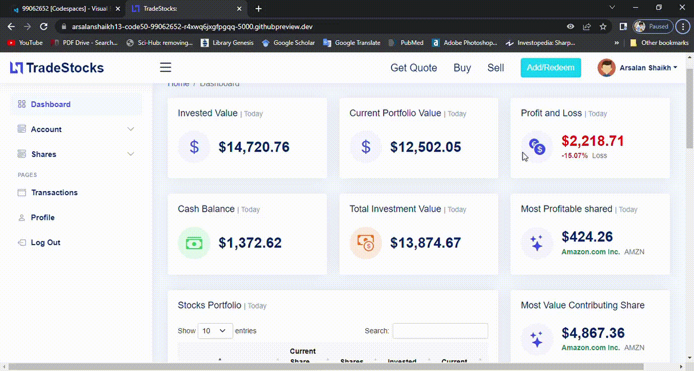

#  PROJECT TITLE: TradeStocks
#### Video Demo:  https://www.youtube.com/watch?v=5iyWlVQoKI0
#### Description:
>This was my final project for the CS50 Introduction to Computer Sciense course.

## About TradeStocks app
it is an app that helps you buy, sell stocks, add and redeem money from account, track your investment, giving realtime data on current share price along with comparing with your invested value thereby giving real time data about  profit and loss of your current portfolio value with respect to invested value and also there are charts and datatables that provide visualization of the contribution of the stocks  to your portfolio in terms of quantity and value thereby helping you to understand the performance of your portfolio and it gets affected whenever you buy and sell shares

## The objective for the app design
The objective of the app design is to make features self explanatory and enable transactions from anywhere from the web application without loading the specific page for transaction for example avoid loading of specific page for buying or selling shares or add or redeem money and this is achieved by using the modal based approach which just loads the popup for entering the transaction details and the transaction takes place in the background and then redirects to dashboard page which is strategic design choice so that all the dashboard show real time changes in the dashboard caused by transactions. This helps in better understanding of the changes in the portfolio.
* The main purpose of the less navigation and strategic navigation is to make smoother user experience and lessen
  the effort and time for navigating in the app which makes the learning curve for the app flat thereby easy and short which enables user to focus their effort into strategizing their investment decisions rather than understanding the navigation of the app.

## Future recommendations
* Provide recommendations of purchasing and selling of certain stocks based on your current portfolio, cash balance
* Providing individuals stocks there own detailed information, tables and graphs in a modal format
* Deleting user profile(either by making their status active or inactive)
* Working on data-migration for any change in the database tables because lot of time there are design changes in the
  paramenters of the tables which requires changes and currently we need to delete the table and create new table with new updated features
* Incorporating more share and stock market related details like detail history of each share, stock market index and
  trends and charts

## What I learned  from the project
* More detailed knowledge and understanding about Python, SQL, HTML, CSS, Javascript languages using REST api following
  MVC pattern and framework for design of web application
* Using stackoverflow, Google,youtube, specific documentation for libraries for understanding technical concepts, problems,
  solution to the problems
* Parsing API responses in JSON format form iexcloud api services for stocks details and also providing data in JSON
  format for charts and tables to reflect real time updation for any change in the database
* Using ORM for querying Sqlite database from python in object oriented format  using flask-sqlalchemy libary
* Linking of data to automatically update at various places using jinja template ex dashbaord data, user_profile data
* Using regular expression for password strength check and setting pattern for password

## User Instruction and features
### Register & Login

| Registration and Login |
| :---: |
||

### Buy and Sell shares, Add and Redeem Money from the account

| Buy Shares | Sell Shares |
| :---: | :---: |
| ||

- Add and Redeem Money

| Add Money | Redeem Money |
| :---: | :---: |
|||

### Update the profile page
- set the profile picture by uploading the picture
- update the profile details along with password


### Frameworks and Libraries
The web application is build using python, SQL, HTML, CSS , Javascript languages
Below are the resources used to build this project.
- [Flask](https://flask.palletsprojects.com/en/1.1.x/) : for managing backend of the application
- [SQLite](https://www.sqlite.org/index.html) : provides database to store the data
- [Jinja2](https://jinja.palletsprojects.com/en/2.11.x/) : template for html manipulation
- [flask_sqlalchemy](https://flask-sqlalchemy.palletsprojects.com/en/2.x/) : querying database using ORM
- [Bootstrap](https://getbootstrap.com/) : frontend framework
- [BootstrapMade](https://bootstrapmade.com/) : for frontend template of web application
- [DatePicker](https://bootstrap-datepicker.readthedocs.io/en/latest/) : for selecting date
- [AOS](https://michalsnik.github.io/aos/) : for animation
- [DataTables](https://datatables.net/) : for table manipulation in the frontend using js
- [Apexcharts](https://apexcharts.com/docs/installation/) : for bar graph and donut chart


## Prerequisite

### Cloning the Repository

```
mkdir project
cd project
git clone https://github.com/arsalanshaikh13/CS50-FinalProject-TradeStocks.git
cd CS50-FinalProject-TradeStocks
```

### iexcloud activation
Activate your iexcloud account through registration to generate your API key
In the terminal type `cd project/application` then `code .env` then set API Key
Set registered API key  as `API_KEY=ENTER YOUR GENERATED API KEY FROM IEXCLOUD`

### Installation
By following these instructions you can run this application on your local machine.

In the terminal type `cd application` to go into application folder and run `npm install`  to install all the npm packages mentioned in packages.json
Come back to root folder by typing `cd ..` in the terminal and then run  `pip install -r requirements.txt` in the terminal to install all the required modules
Type `flask run` in the terminal to start the app
  
## About CS50
CS50’s Introduction to Computer Science is a openware course from Havard University and taught by David J. Malan

This course teaches students the art of programming by making them understand how to think algorithmically and solve problems efficiently. Topics include abstraction, algorithms, data structures, encapsulation, resource management, security, and software engineering. Languages include C, Python, SQL, HTML, CSS, and JavaScript (for web development).

Thank you for all CS50.

- Where to look for CS50 course?
https://cs50.harvard.edu/x/2022/
